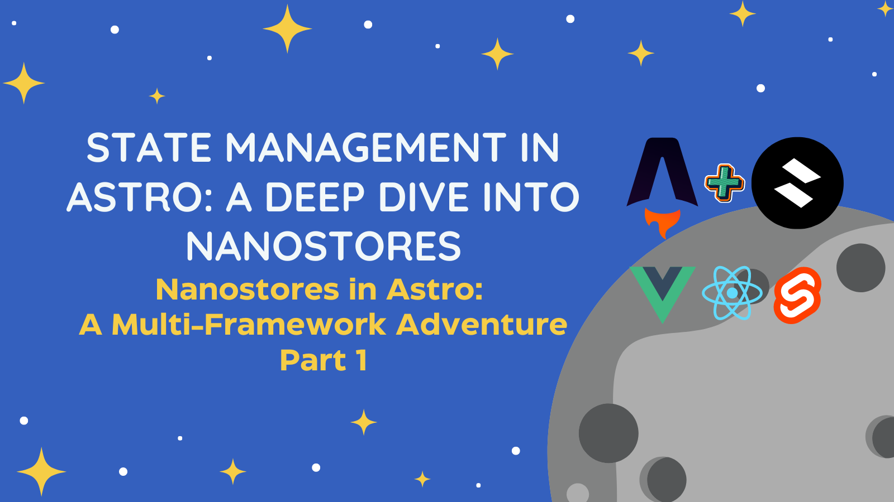

# Nanostores in Astro: A Multi-Framework Adventure



## About This Project

This repository contains the demo site for the article series "Nanostores in Astro: A Multi-Framework Adventure". It showcases how to effectively manage state across multiple frameworks (Astro, React, Vue, and Svelte) using Nanostores in an Astro project.

🔗 [Read the full article series on Hashnode](placeholder-for-hashnode-article-link)

## Features

- Independent state management examples
- Shared state management across frameworks
- Persistent state demonstration
- Interactive counters and forms built with multiple frameworks

## Tech Stack

- [Astro](https://astro.build/) - The web framework for content-driven websites
- [Nanostores](https://github.com/nanostores/nanostores) - A tiny state manager for React, Preact, Vue, Svelte, and vanilla JS
- [React](https://reactjs.org/) - A JavaScript library for building user interfaces
- [Vue](https://vuejs.org/) - The Progressive JavaScript Framework
- [Svelte](https://svelte.dev/) - Cybernetically enhanced web apps
- [TypeScript](https://www.typescriptlang.org/) - Typed JavaScript at Any Scale
- [Tailwind CSS](https://tailwindcss.com/) - A utility-first CSS framework
- [Web Components](https://developer.mozilla.org/en-US/docs/Web/Web_Components) - A suite of technologies for creating reusable custom elements

## Getting Started

1. Clone the repository:

```bash
git clone https://github.com/yourusername/nanostores-astro-demo.git
```

2. Navigate to the project directory:

```bash
cd nanostores-astro-demo
```

3. Install dependencies:

```bash
npm install # or pnpm install or yarn install
```

4. Run the development server:

```bash
npm run dev # or pnpm run dev or yarn run dev
```

5. Open your browser and visit `http://localhost:4321`

## Project Structure

- `src/pages/` - Astro pages
- `src/components/` - Reusable components (Astro, React, Vue, Svelte)
- `src/stores/` - Nanostore definitions
- `src/layouts/` - Layout components
- `src/assets/` - Static assets

## Author

**Meir J Cohen**

- GitHub: [@MeirJC](https://github.com/MeirJC)
- LinkedIn: [Meir Jacob Cohen](https://www.linkedin.com/in/meirjcohen/)
- Twitter/X: [@MeirJC](https://x.com/MeirJC")
- Hashnode: [@MeirJC](https://hashnode.com/@MeirJC)
